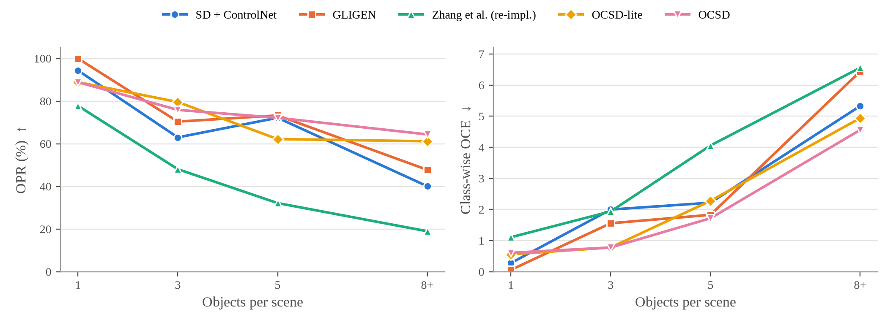
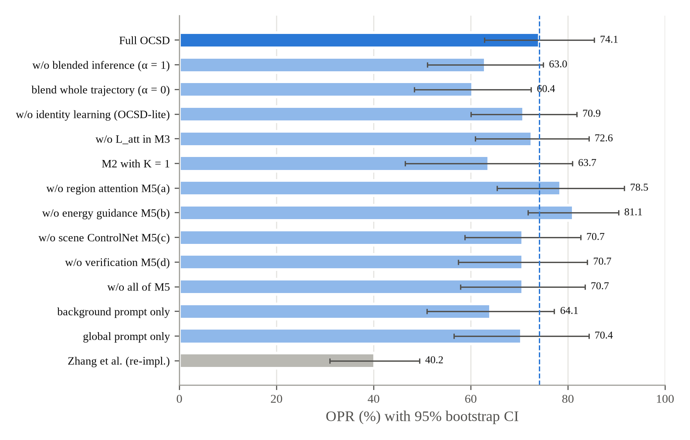
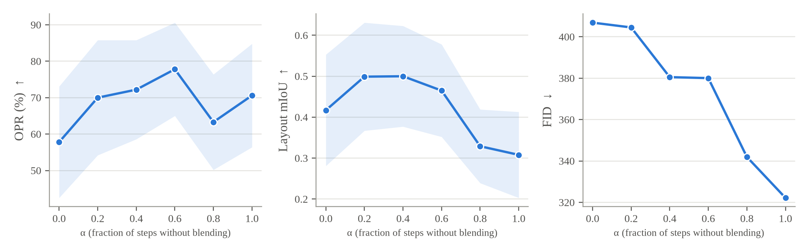

::: {custom-style="Author"}
Le Hoang Bao, Thai Ba Cuong, Nguyen Thanh Chuyen
:::

::: {custom-style="Affiliation"}
Faculty of Information Technology, Industrial University of Ho Chi Minh City, Vietnam
:::

::: {custom-style="Note"}
**Manuscript status (2 October 2026).** All numbers come from the final paper-tier run (1 October 2026, NVIDIA A100) and are final, except the FID and KID columns marked ‡, which will be recomputed on equal sample sizes by an evaluation-only pass.
:::

::: {custom-style="AbstractTitle"}
Abstract
:::

::: {custom-style="Abstract"}
Sketch-and-text conditioned diffusion models such as ControlNet produce realistic images from a single object sketch, but they lose objects, miscount them and misplace them as soon as a freehand scene sketch contains several objects. We study this *object-consistency* problem and make three contributions. First, we propose OCSD (Object-Consistent Sketch-guided Diffusion), a framework that decomposes the sketch into objects, generates and selects each object independently, learns a per-object identity token with a masked diffusion loss, composes the scene with blended latent inference, and adds an object-aware conditioning module that restricts cross-attention to each object's sketch region, steers attention with an energy function, re-injects the scene sketch through a low-weight ControlNet and verifies the result with an open-set detector. Second, we build an evaluation protocol that isolates object consistency: QuickDraw-Scenes, a controlled benchmark of real freehand object sketches arranged into 1 to 10-object scenes at three abstraction levels, and COCO-Sketch, a real-image benchmark; object preservation, class-wise count error, layout IoU and relation accuracy are scored with a detector (OWLv2) that the method never sees, alongside a detector ceiling, a best-of-3 control for regeneration, bootstrap confidence intervals and Holm-corrected Wilcoxon tests. Third, we report a controlled comparison of nine methods on a shared Stable Diffusion 1.5 backbone. On QuickDraw-Scenes, OCSD preserves the most objects (75.4% vs. 72.9% for the box-conditioned GLIGEN and 67.4% for ControlNet), has the lowest class-wise count error (1.92 vs. 2.47) and the highest relation accuracy (52.3% vs. 43.2%), and keeps 16.6 points more objects than GLIGEN in scenes with 8 to 10 objects; GLIGEN remains ahead on count accuracy and layout IoU, and none of the differences to it is significant after Holm correction. OCSD is significantly better than a faithful re-implementation of the two-branch method of Zhang et al. on every consistency metric (Holm-adjusted p ≤ 0.0005), and on real COCO scenes it is tied with GLIGEN at 92% of the detector ceiling. An ablation shows that blended inference and candidate selection carry most of the gain and that the region-attention and energy-guidance components of M5 overlap. We release code, benchmarks and all per-scene results.
:::

**Keywords:** diffusion models, sketch-to-image, scene generation, object consistency, controllable generation, evaluation protocol.

# 1. Introduction

Text-to-image diffusion models [@rombach2022ldm; @saharia2022imagen; @ramesh2022dalle2] have made photorealistic synthesis accessible, and spatial adapters such as ControlNet [@zhang2023controlnet] and T2I-Adapter [@mou2024t2i] let a user add a sketch to control shape and layout. For a single object this works well. For a *scene* sketch, which a non-expert draws as several rough objects on one canvas, it frequently does not. The control network treats the whole sketch as one geometric map: it knows *where* there are strokes, but not *which strokes belong to which object*, and binding each region to a phrase of the prompt is left to cross-attention. The result is a familiar set of failures: objects disappear (especially small or abstract ones), duplicates merge or multiply, attributes leak between objects, and objects drift away from where they were drawn. Recent analysis shows that scene complexity, not data imbalance, is the main driver of these multi-object failures, and that counting and spatial relations are the least robust abilities [@jeong2026multiobj].

We call the requirement that the generated image contain *the right objects, in the right number, at the right place and shape, in the right relations* **object consistency**, and we make it the explicit target of both the method and the evaluation. The closest prior work, Zhang et al. [@zhang2025sketchscene], splits generation into an object-level stage (generate each object from its own sketch, learn an identity embedding with a masked loss) and a scene-level stage (blend object and background latents early, then denoise freely with identity tokens). This preserves object appearance, but once blending ends nothing keeps an object in its region, and the prompt describes only the background. The authors themselves note that objects are still lost as the object count grows.

This paper makes three contributions:

1. **OCSD, an object-aware extension of the two-branch approach.** Object phrases from the user's prompt drive object generation, the best of *K* candidates is selected by semantic, shape and detection scores, identity tokens are trained with an additional attention-separation term, and a new object-aware conditioning module (M5) acts during the free-denoising phase through four mechanisms: region-restricted cross-attention, attention-energy guidance, a low-weight scene ControlNet and post-hoc verification with regeneration (Section 3).
2. **An evaluation protocol for object consistency.** Two automatically built benchmarks, QuickDraw-Scenes (controlled object count and sketch abstraction, real freehand strokes) and COCO-Sketch (real photographs), with metrics scored by an evaluation detector that differs from the one the method uses internally, a detector-ceiling row, a best-of-3 control that gives baselines the same regeneration budget, a held-out tuning split, and paired statistical tests (Section 4).
3. **A controlled, honest comparison.** Eight methods run on the same backbone, sampler, seeds and scenes. We report where OCSD helps, where it does not, and which component is responsible (Section 5).

# 2. Related Work

**Sketch-to-image generation.** Early work used conditional GANs: pix2pix [@isola2017pix2pix] for pixel-aligned edges and SketchyGAN [@chen2018sketchygan] on the Sketchy database [@sangkloy2016sketchy]. With diffusion models, Voynov et al. [@voynov2023sketch] guide sampling with a latent edge predictor, and Koley et al. [@koley2023picture; @koley2024sketch] argue that abstract sketches should be interpreted semantically rather than traced pixel by pixel. ControlNet [@zhang2023controlnet], T2I-Adapter [@mou2024t2i] and Uni-ControlNet [@zhao2023unicontrolnet] add spatial conditions to a frozen text-to-image model and are the de facto baselines for sketch control.

**Scene-level sketches.** Sketch2Photo [@chen2009sketch2photo] composed retrieved photographs; SketchyCOCO [@gao2020sketchycoco] separated foreground and background with EdgeGAN but covers only 14 foreground classes; FS-COCO [@chowdhury2022fscoco] and SketchyScene [@zou2018sketchyscene] provide freehand scene sketches. Unsupervised and text-guided scene sketch-to-photo methods [@wang2022unsupscene; @maungmaung2023textscene] normalise sketches and photos to an edge domain, Cheng et al. [@cheng2024multiobj] address multi-object interference with per-object control, FineControlNet [@choi2023finecontrolnet] injects region-wise text alongside spatial control, and SketchingReality [@bourouis2026sketchingreality] trains a sketch-semantics modulation network with attention supervision. Zhang et al. [@zhang2025sketchscene] is our starting point and is described in Section 1.

**Layout and multi-object control.** For text prompts, Attend-and-Excite [@chefer2023attend] maximises the attention of neglected tokens, Structured Diffusion [@feng2023structured] and SynGen [@rassin2023linguistic] bind attributes through syntax, and Composable Diffusion [@liu2022composable] adds score functions. With boxes, GLIGEN [@li2023gligen] trains gated self-attention layers for grounding, while BoxDiff [@xie2023boxdiff], Layout Guidance [@chen2024trainingfreelayout] and Attention Refocusing [@phung2024refocus] steer attention maps with energy functions at inference; DenseDiffusion [@kim2023dense] modulates attention scores with region masks and MultiDiffusion [@bartal2023multidiffusion] fuses region-wise diffusion paths. Object-level semantic alignment has also been shown to improve multi-object fidelity [@liu2026objalign]. These methods use boxes or masks, not the shape information of a freehand sketch, and have no notion of object identity.

**Identity and consistency.** Textual Inversion [@gal2023textual], DreamBooth [@ruiz2023dreambooth], LoRA [@hu2022lora] and IP-Adapter [@ye2023ipadapter] personalise a model to a concept; Break-A-Scene [@avrahami2023breakascene] extracts several concepts from one image with a masked loss and a cross-attention loss; MasaCtrl, ConsiStory and StoryDiffusion [@cao2023masactrl; @tewel2024consistory; @zhou2024storydiffusion] share self-attention to keep subjects consistent across images. OCSD borrows the masked loss and attention supervision for per-scene identity tokens, and combines them with sketch-derived regions.

# 3. Method

## 3.1 Problem formulation

The input is a scene sketch $\mathcal{S}$ of size $H\times W$ ($512\times512$) containing $N$ foreground objects and a prompt $\mathcal{P}$ that contains object phrases $\{p_1,\ldots,p_N\}$ (class and attributes, e.g. "two white sheep") and a background phrase $p_{bg}$. Each object carries *object information* $o_i=(c_i,\mathbf{m}_i,\mathbf{b}_i,a_i)$: class, region mask, bounding box and attributes, and the objects are linked by spatial relations $\mathcal{R}=\{(i,j,r)\}$ with $r\in\{$left, right, above, below, in front, behind$\}$. An output image $\mathbf{I}$ is *object-consistent* if (R1) every object appears with the right class and attributes, (R2) the per-class count matches the sketch, (R3) each object occupies its sketched region and follows its shape, and (R4) every relation in $\mathcal{R}$ holds. We ask: (Q1) how fast does a sketch-conditioned baseline degrade as object count and sketch abstraction grow; (Q2) does splitting generation into object and scene levels with identity tokens help; and (Q3) does object-aware conditioning reduce the remaining loss, count and relation errors.

## 3.2 Overview

Figure 1 shows the pipeline. M1 parses the sketch and prompt into objects. The object-level branch generates each object (M2) and learns its identity (M3); the scene-level branch composes the scene with blended and customised inference (M4) under object-aware conditioning (M5). All modules share Stable Diffusion 1.5 [@rombach2022ldm] with ControlNet Scribble v1.1, so every baseline in Section 5 can run on the same backbone.

{width=6.5in}

## 3.3 Object decomposition (M1)

The sketch is binarised, padded to $512\times512$, thinned and re-thickened to about 3 px to match ControlNet Scribble's training distribution. Strokes are grouped into objects from drawing layers when the user draws one object per layer (the interactive mode), from benchmark annotations, or, as a fallback, by connected components after dilation. The mask $\mathbf{m}_i$ is the convex hull of the object's strokes after morphological closing, dilated by 9 px, and $\mathbf{b}_i$ is its bounding box. Relations follow geometric rules on box centres with a margin $\delta=0.05W$; "in front of" is decided by the lower box edge under a ground-plane assumption. Object phrases are matched to sketched objects by class and left-to-right order, and the global prompt is rebuilt as $\mathcal{P}_g=$ "a photo of $\langle o_1\rangle$ $c_1$ and … $\langle o_N\rangle$ $c_N$, $p_{bg}$".

## 3.4 Object-level generation with candidate selection (M2)

Each object sketch is cropped to its box, centred and resized to $512\times512$, and $K$ candidates are generated with ControlNet Scribble and the prompt "a photo of a $p_i$, simple white background". Using the user's full phrase, not only the class name as in [@zhang2025sketchscene], attaches attributes to the right object from the start. Grounded-SAM [@ren2024groundedsam; @liu2024groundingdino; @kirillov2023sam] segments each candidate, and the candidate with the highest normalised score

$$k^*=\arg\max_k\Big[\lambda_1\,\mathrm{CLIP}\big(\mathbf{x}_i^{(k)}\odot\hat{\mathbf{m}}_i^{(k)},p_i\big)+\lambda_2\,\mathrm{IoU}\big(\hat{\mathbf{m}}_i^{(k)},\mathbf{m}_i^{crop}\big)+\lambda_3\,\mathrm{conf}_{det}\Big]$$

is kept ($\lambda_1=\lambda_2=\lambda_3=1$), rewarding correct semantics, faithful shape and a confident detection. M2 and M3 run once per scene with a fixed preparation seed and are reused across generation seeds and ablation variants, so that differences between variants come only from the changed component.

## 3.5 Identity learning (M3)

For each object a new token $\langle o_i\rangle$ is added to the text encoder, initialised from the embedding of $c_i$, and trained on its object image with the masked diffusion loss

$$\mathcal{L}_{id}=\frac{1}{N}\sum_{i=1}^{N}\mathbb{E}_{\boldsymbol{\epsilon},t}\Big[\big\|\big(\boldsymbol{\epsilon}-\boldsymbol{\epsilon}_{\theta,\Delta}(\mathbf{z}_{i,t},t,\text{“a photo of }\langle o_i\rangle\,c_i\text{”})\big)\odot\tilde{\mathbf{m}}_i\big\|_2^2\Big].$$

Training has two stages: embeddings only (learning rate $5\times10^{-3}$), then embeddings ($5\times10^{-5}$) jointly with rank-16 LoRA [@hu2022lora] on the attention projections ($10^{-4}$). To keep tokens of same-class objects apart, we add an attention-separation term computed on random composites of two or three objects (up to six composites per scene, sampled with probability 0.35):

$$\mathcal{L}_{M3}=\mathcal{L}_{id}+\lambda_{att}\,\frac{1}{N}\sum_{i}\big\|\bar{A}_i-\tilde{\mathbf{m}}_i\big\|_2^2,\qquad \lambda_{att}=0.01,$$

where $\bar{A}_i$ is the normalised $16\times16$ cross-attention map of $\langle o_i\rangle$, in the spirit of Break-A-Scene [@avrahami2023breakascene].

## 3.6 Scene composition (M4)

Object images are cut out with their masks, scaled and shifted to maximise IoU with the sketch masks, and pasted far-to-near, giving a foreground image with latent $\mathbf{z}_{fg,0}$ and a union mask $\tilde{\mathbf{m}}$. A background latent $\mathbf{z}_{bg,t}$ is denoised from noise with the prompt "a photo of $p_{bg}$"; its negative prompt lists the foreground classes so that the background does not spawn extra copies of them (applied to both OCSD and our Zhang et al. re-implementation). Denoising then has two phases:

$$\mathbf{z}_t\leftarrow\mathbf{z}_{bg,t}\odot(1-\tilde{\mathbf{m}})+\mathbf{z}_{fg,t}\odot\tilde{\mathbf{m}}\quad (t>\alpha T),\qquad \mathbf{z}_{t-1}=\mathrm{Denoise}_{\theta,\,s\Delta}(\mathbf{z}_t,\mathcal{P}_g,t)\quad(t\le\alpha T).$$

Blending locks the layout while it is formed; customised inference then harmonises lighting and boundaries while the identity tokens keep each object's appearance. At inference the LoRA update is scaled by a strength $s\in(0,1]$. Because $\mathbf{z}_t$ is overwritten at every blending step, only the background branch needs to be denoised during blending; the scene U-Net runs from the last blending step on, which gives identical results with about half the U-Net calls.

## 3.7 Object-aware conditioning (M5)

M5 replaces the plain denoising step of the customised phase with four mechanisms, each aimed at one consistency requirement.

**(a) Region-restricted cross-attention (R1, R3).** Let $\mathcal{T}_i$ index the prompt tokens of object $i$ (its identity token, attributes and class) and $\mathcal{T}_{bg}$ those of the background phrase. A bias is added before the softmax,

$$A=\mathrm{softmax}\Big(\tfrac{QK^\top}{\sqrt d}+B\Big),\quad B_{n,j}=\begin{cases}-\lambda_t & j\in\mathcal{T}_i,\ n\notin\tilde{\mathbf{m}}_i\\ -\lambda_t & j\in\mathcal{T}_{bg},\ n\in\tilde{\mathbf{m}}\\ 0&\text{otherwise,}\end{cases}\qquad \lambda_t=\lambda_0\big(t/\alpha T\big)^{\gamma},$$

so each object's tokens act only inside its own sketch region and the background tokens only outside the foreground; the restriction relaxes towards the end so boundaries can blend. This resembles DenseDiffusion [@kim2023dense], but uses sketch-shaped masks and identity tokens.

**(b) Attention-energy guidance (R1, R2).** During the first $\tau$ customised steps, the latent is updated by $\mathbf{z}_t\leftarrow\mathbf{z}_t-\eta_t\nabla_{\mathbf{z}_t}E$ with

$$E(\mathbf{z}_t)=\sum_{i=1}^{N}\Big[\big(1-\max_{n\in\tilde{\mathbf{m}}_i}\bar{A}_i[n]\big)+\beta\,\frac{\sum_{n\notin\tilde{\mathbf{m}}_i}\bar{A}_i[n]}{\sum_n\bar{A}_i[n]}\Big].$$

The first term penalises an object that no location attends to strongly (a missing object), as in Attend-and-Excite [@chefer2023attend]; the second penalises attention outside the region (drift or duplication), as in BoxDiff and Layout Guidance [@xie2023boxdiff; @chen2024trainingfreelayout]. Attention maps follow Attend-and-Excite (drop the start token, scale by 100, softmax over text tokens, $3\times3$ Gaussian smoothing), and $\eta_t$ decays linearly from $\eta$ to $\eta/2$. Which tokens the energy acts on is a design choice: steering the identity tokens $\langle o_i\rangle$ turned out to be harmful, and the final configuration, chosen on the tuning split (Section 4.4), steers the object-phrase tokens (attributes and class words) of each object.

**(c) Low-weight scene ControlNet (R3, R4).** The full scene sketch is fed to ControlNet Scribble with conditioning scale $\omega=0.4$ during customised inference, reminding the model of contours and relative placement after hard blending stops, without imposing strokes on the background.

**(d) Post-hoc verification (R1, R2, R4).** Grounding DINO (threshold 0.35) detects every sketched class; detections are matched to sketch boxes by same-class Hungarian matching on IoU. An image passes when every object is matched, every class count is correct and every relation holds. Otherwise OCSD regenerates with a new seed and $\lambda_0\times1.5$, at most $R=2$ times, and returns the image with the highest $\mathrm{OPR}+0.5\,\mathrm{mIoU}+0.25\,\mathrm{RA}-0.25\,\mathrm{OCE}_c/N$. The verifier deliberately differs from the evaluation detector (Section 4.3).

Table 1 lists the hyperparameters. The default column is the full configuration in the code; the experiment column is the reduced setting that fits a Colab Pro budget, with $\alpha$ and $s$ chosen on a held-out tuning split (Section 4.4).

::: {custom-style="TableCaption"}
**Table 1.** OCSD hyperparameters: code default and the setting used in all experiments.
:::

| Symbol | Meaning | Default | Experiments |
|:--|:--|:--:|:--:|
| $T$, $w$ | DDIM steps, CFG scale | 50, 7.5 | 30, 7.5 |
| $K$ | candidates per object (M2), denoising steps | 4, 30 | 2, 20 |
| $S_1$, $S_2$ | embedding / joint steps (M3), LoRA rank | 200 / 200, 16 | 100 / 100, 16 |
| $\alpha$, $s$ | blending switch point, LoRA strength (M4) | 0.5, 1.0 | 0.1, 0.5 (tuned) |
| $\lambda_0$, $\gamma$ | region-attention strength and decay (M5a) | 8, 1 | 8, 1 |
| $\beta$, $\eta$, $\tau$ | energy guidance (M5b), steered tokens | 1, 20, 10 steps, identity | 1, 20, 10 steps, phrase (tuned) |
| $\omega$ | scene ControlNet scale (M5c) | 0.4 | 0.4 |
| $R$ | maximum regenerations (M5d) | 2 | 2 |

# 4. Evaluation Protocol

## 4.1 Benchmarks

Public scene-sketch datasets [@gao2020sketchycoco; @chowdhury2022fscoco] do not let us vary object count and sketch abstraction independently, and do not provide per-object sketches with phrases. We therefore build two complementary benchmarks, both generated automatically by the released code.

**QuickDraw-Scenes.** Real freehand object sketches from Quick, Draw! [@jongejan2016quickdraw] in 28 classes shared with COCO are arranged on a $512\times512$ canvas with a perspective layout in 12 settings (e.g. "in a green meadow", "on a city street"), so class, mask, box and relations of every object are known exactly. Scenes form a $4\times3$ grid: 1, 3, 5 or 8 to 10 objects, times three abstraction levels. Sketch detail is measured as points plus ten times strokes and split into per-class terciles: *simple* uses the most detailed tercile, recognised sketches and no overlap; *medium* the middle tercile with box IoU up to 0.15; *complex* the most abstract tercile, IoU up to 0.30, Gaussian stroke jitter ($\sigma=2.5$ px) and thinner strokes. To test counting, 40% of objects duplicate an existing class and phrase ("three white sheep"), and the caption states the counts so that text-only methods also know them.

**COCO-Sketch.** COCO val2017 [@lin2014coco] images with 1 to 8 salient objects (each at least 1.5% of the image and not cut by the border), balanced over 1, 2–3, 4–5 and 6–8 objects, cropped to $512\times512$. Sketches are PiDiNet [@su2021pidinet] scribbles, split per object by the ground-truth masks; captions are the human COCO captions. Real images allow FID/KID and a detector ceiling.

## 4.2 Protocol

The paper tier uses 72 QuickDraw-Scenes scenes (6 per cell). Methods that need per-scene identity learning (OCSD, Zhang et al.) run on a stratified 36-scene subset (3 per cell) with two seeds; training-free methods run on all 72 with seed 0 and additionally with seed 1 on the 36-scene subset, so the main comparison has every method on the same scenes and seeds. On COCO-Sketch, training-free methods run on 32 scenes and all methods on a common 16-scene subset (one seed). The ablation uses 18 identity-learning scenes with 3 and 5 objects, and the $\alpha$ study 12 of them (one seed). Every method uses SD 1.5, DDIM with 30 steps, CFG 7.5, the same negative prompt and the same seeds. Experiments ran on one NVIDIA A100 40 GB in Google Colab.

## 4.3 Metrics

Detection-based metrics use **OWLv2** [@minderer2023owlv2] (threshold 0.30), queried with the sketched class names; detections are matched to sketch boxes by same-class Hungarian matching with IoU at least 0.1. OWLv2 is deliberately different from Grounding DINO, which OCSD uses inside M2 and M5(d), so the method cannot be rewarded for optimising against its own judge.

- **Object preservation rate** $\mathrm{OPR}=N_{preserved}/N_{input}$ (R1).
- **Class-wise object count error** $\mathrm{OCE}_c=\sum_c\left|N_{gen,c}-N_{input,c}\right|$, which, unlike the total count error, cannot cancel a missing object of one class against an extra object of another; and **count accuracy**, the share of images with $\mathrm{OCE}_c=0$ (R2).
- **Layout mIoU** between matched detections and sketch boxes, unmatched objects counting as zero (R3), and **relation accuracy (RA)**, the share of sketch relations preserved (R4).
- **CLIP score** [@hessel2021clipscore] with ViT-L/14 [@radford2021clip] for the whole image, and **object CLIP**, computed on crops at the *sketch* boxes against "a photo of a $p_i$", which checks attribute binding independently of the detector.
- **ID-Sim**, the DINOv2 [@oquab2024dinov2] cosine similarity between each object region in the scene and its M2 object image (two-branch methods only), and **FID/KID** [@heusel2017fid; @binkowski2018kid] against 2,000 COCO val2017 crops.

**Detector ceiling and fair controls.** On COCO-Sketch we score the real photographs themselves: they certainly contain all objects, so their OPR bounds what OWLv2 lets any method reach. Because OCSD may generate up to three times, we add **ControlNet best-of-3**, which regenerates the baseline with the *same* verifier and selection score, so any gain of M5(d) over it is not just extra sampling.

**Statistics.** Metrics are averaged over seeds per scene and then over scenes, reported as mean ± half-width of a 95% bootstrap interval (2,000 scene resamples) [@efron1993bootstrap]. OCSD is compared with each method by a paired Wilcoxon signed-rank test on per-scene values [@wilcoxon1945] with Holm correction [@holm1979].

## 4.4 Held-out tuning

A pilot run with the default $\alpha=0.5$, $s=1.0$ showed that OPR rose as $\alpha$ fell and that full OCSD trailed OCSD-lite, suggesting that full-strength identity LoRA pulls the scene away from the sketch layout. Before the paper run we therefore tuned $\alpha\in\{0,0.1,0.2,0.3,0.5\}\times s\in\{0.5,1.0\}$ with two seeds on the 16 pilot scenes (12 QuickDraw-Scenes, 4 COCO-Sketch), which are **excluded from every evaluation set**. The rule selects the maximum OPR + mIoU + RA subject to global CLIP within 1 point of the default. It chose $\alpha=0.1$, $s=0.5$ (score 1.562 vs. 1.294 for the default; OPR 66.4% vs. 57.0%, mIoU 0.484 vs. 0.371, CLIP 26.36 vs. 26.37). LoRA strength 0.5 beat 1.0 for four of five $\alpha$ values. Our Zhang et al. re-implementation keeps its published setting ($\alpha=0.5$, $s=1.0$). A first paper-tier run showed that energy guidance on the identity tokens was harmful (removing it raised OPR by 18.5 points in the ablation), so a second tuning phase on the same held-out scenes, with $\alpha$ and $s$ fixed, compared five M5(b) options with the same rule: off, identity tokens with $\eta\in\{10,20\}$ and object-phrase tokens with $\eta\in\{10,20\}$. Phrase tokens with $\eta=20$ won (score 1.754; OPR 70.8%, RA 53.2%), ahead of phrase tokens with $\eta=10$ (1.736) and no guidance (1.704); the original identity-token setting came last (1.414). Only OCSD-family images were regenerated; baselines were unchanged.

# 5. Results

## 5.1 Compared methods

(1) **SD + ControlNet** Scribble on the whole sketch (scale 1.0); (2) **T2I-Adapter** Sketch [@mou2024t2i]; (3) **GLIGEN** [@li2023gligen] with per-object boxes and phrases (no sketch shape); (4) **ControlNet + region attention**, DenseDiffusion-style [@kim2023dense] masking with the same masks and phrases as OCSD, replacing FineControlNet [@choi2023finecontrolnet], which has no public SD 1.5 code; (5) **ControlNet + attention energy**, BoxDiff/Attend-and-Excite-style [@xie2023boxdiff; @chefer2023attend]; (6) **ControlNet best-of-3**; (7) **Zhang et al.** [@zhang2025sketchscene], re-implemented in the same code base: one candidate with a class-name prompt, no attention separation, $\alpha=0.5$, no M5; (8) **OCSD-lite**, OCSD without identity learning (training-free); (9) **OCSD**.

## 5.2 Main comparison

::: {custom-style="TableCaption"}
**Table 2.** QuickDraw-Scenes, 36 identity-learning scenes × 2 seeds (mean ± 95% CI half-width). Bold: best. ‡ FID is provisional (see text).
:::

| Method | OPR (%) ↑ | OCE~c~ ↓ | Count acc. (%) ↑ | mIoU ↑ | RA (%) ↑ | Obj. CLIP ↑ | ID-Sim ↑ | FID ‡ ↓ |
|:--|:--:|:--:|:--:|:--:|:--:|:--:|:--:|:--:|
| SD + ControlNet | 67.4 ± 8.9 | 2.46 ± 0.81 | 25.0 ± 13.2 | 0.510 ± 0.080 | 36.6 ± 10.4 | 23.52 | – | 225.0 |
| T2I-Adapter | 60.5 ± 9.7 | 2.89 ± 0.92 | 22.2 ± 11.8 | 0.470 ± 0.080 | 28.3 ± 10.6 | 22.70 | – | 236.8 |
| GLIGEN | 72.9 ± 8.2 | 2.47 ± 1.03 | **41.7 ± 14.6** | **0.565 ± 0.073** | 43.2 ± 11.1 | 24.04 | – | **219.4** |
| CN + region attention | 68.0 ± 9.2 | 2.86 ± 1.03 | 29.2 ± 13.2 | 0.508 ± 0.082 | 38.0 ± 12.1 | 23.56 | – | 224.7 |
| CN + attention energy | 70.5 ± 8.2 | 3.06 ± 1.40 | 30.6 ± 13.2 | 0.496 ± 0.076 | 42.3 ± 11.5 | **24.22** | – | 226.3 |
| CN best-of-3 | 70.1 ± 8.7 | 2.47 ± 0.87 | 29.2 ± 14.6 | 0.530 ± 0.080 | 41.1 ± 10.8 | 23.62 | – | 225.3 |
| Zhang et al. (re-impl.) | 44.3 ± 10.9 | 3.42 ± 0.85 | 12.5 ± 8.3 | 0.251 ± 0.078 | 10.1 ± 4.7 | 20.08 | 0.276 | 248.0 |
| OCSD-lite | 73.0 ± 8.7 | 2.14 ± 0.72 | 33.3 ± 13.2 | 0.550 ± 0.075 | 47.9 ± 11.1 | 23.76 | 0.433 | 249.3 |
| OCSD | **75.4 ± 8.2** | **1.92 ± 0.67** | 36.1 ± 13.9 | 0.547 ± 0.075 | **52.3 ± 11.2** | 23.96 | **0.467** | 279.9 |

**OCSD has the best object preservation, count error and relation accuracy.** On QuickDraw-Scenes (Table 2), OCSD preserves 75.4% of sketched objects, against 72.9% for GLIGEN, 70.5% for the strongest ControlNet variant and 67.4% for the ControlNet baseline. It has the lowest class-wise count error (1.92 vs. 2.46–3.06 for every baseline), the highest relation accuracy (52.3% vs. 43.2% for GLIGEN and 36.6% for the baseline), and the highest identity similarity (0.467). GLIGEN remains ahead on count accuracy (41.7% vs. 36.1%) and layout mIoU (0.565 vs. 0.547), and matches OCSD on global and object CLIP, so OCSD does not dominate it.

**Significance.** With 36 scenes the intervals overlap, and we report the paired tests literally. OCSD is significantly better than the Zhang et al. re-implementation on all five tested metrics (OPR +31.1 points, $\mathrm{OCE}_c$ −1.50, mIoU +0.296, RA +42.2 points, object CLIP +3.89; Wilcoxon with Holm correction over all comparisons, $p_{Holm}\le0.0005$) and than T2I-Adapter on RA and object CLIP ($p_{Holm}=0.047$ and $0.039$). Against GLIGEN, the attention-control baselines and best-of-3, no difference survives Holm correction (unadjusted $p$ from 0.23 to 0.96 against GLIGEN; the smallest against the ControlNet baseline is RA, $p=0.035$). The honest summary is that OCSD is *at least on par with* the strongest baseline and better on the metrics it targets, but that a larger benchmark is needed to call the gains over GLIGEN significant.

**Two-branch generation needs object-aware conditioning (Q2).** Our Zhang et al. re-implementation is the weakest method: with blending switched off halfway ($\alpha=0.5$) and nothing constraining the free phase, objects drift and vanish (OPR 44.3%, RA 10.1%). The same object/scene decomposition, with candidate selection, a long blending phase and M5, becomes the best method on OPR and RA. The regeneration control matters for reading this result: best-of-3 lifts the baseline from 67.4% to 70.1% OPR with the same verifier, so most of OCSD's 8-point margin over the baseline does not come from extra sampling.

**Identity learning.** OCSD-lite, which skips M3 and is training-free, is already competitive (73.0% OPR, $\mathrm{OCE}_c$ 2.14, RA 47.9%). Full OCSD adds 2.4 points of OPR, 4.4 points of RA, a lower count error and higher identity similarity (0.467 vs. 0.433), none significant on its own ($p\ge0.26$).

**Image quality (provisional).** Two-branch methods have higher FID (OCSD 279.9 vs. 225.0 for the baseline). These FID/KID values are provisional: in this run baselines were scored on 108 images and the identity-learning methods on 72, and FID depends on sample size; the code now scores all E3 methods on the same images, and the columns will be recomputed by an evaluation-only pass. The qualitative results (Figure 2) show a real part of the gap: pasted objects and visible blending seams.

::: {custom-style="TableCaption"}
**Table 3.** Training-free methods on all 72 QuickDraw-Scenes scenes (seed 0).
:::

| Method | OPR (%) ↑ | OCE~c~ ↓ | Count acc. (%) ↑ | mIoU ↑ | RA (%) ↑ | CLIP ↑ |
|:--|:--:|:--:|:--:|:--:|:--:|:--:|
| SD + ControlNet | 65.2 ± 6.5 | 2.49 ± 0.57 | 26.4 ± 9.7 | 0.493 ± 0.058 | 32.0 ± 7.5 | 27.98 |
| T2I-Adapter | 61.7 ± 7.3 | 2.92 ± 0.65 | 26.4 ± 9.0 | 0.485 ± 0.064 | 29.5 ± 8.6 | 27.30 |
| GLIGEN | **71.4 ± 6.3** | 2.54 ± 0.72 | **38.9 ± 10.4** | **0.548 ± 0.054** | 41.0 ± 8.3 | 27.98 |
| CN + region attention | 66.5 ± 6.8 | 2.83 ± 0.70 | 28.5 ± 10.4 | 0.492 ± 0.059 | 32.8 ± 8.1 | 27.61 |
| CN + attention energy | 70.0 ± 5.7 | 2.78 ± 0.84 | 31.9 ± 10.1 | 0.490 ± 0.056 | 38.0 ± 8.0 | **28.59** |
| CN best-of-3 | 67.8 ± 6.2 | 2.35 ± 0.56 | 29.9 ± 9.7 | 0.507 ± 0.057 | 34.6 ± 7.4 | 28.23 |
| OCSD-lite | 71.2 ± 6.7 | **2.12 ± 0.55** | 37.5 ± 10.8 | 0.530 ± 0.058 | **44.9 ± 9.0** | 27.80 |

On all 72 scenes (Table 3), the training-free OCSD-lite ties GLIGEN on OPR (71.2% vs. 71.4%), has the lowest count error and the highest relation accuracy, and beats the ControlNet baseline on every consistency metric (OPR +6.0, RA +12.9 points), which confirms that the main-table ranking is not an artefact of the 36-scene subset.

{width=6.5in}

## 5.3 Degradation with object count and abstraction (E1, E2)

{width=6.5in}

Figure 3 answers Q1. The ControlNet baseline falls from 94.4% OPR on single objects to 40.1% at 8–10 objects, and its count error grows from 0.28 to 5.33; Zhang et al. collapses fastest (77.8% to 19.0%). OCSD pays a small price on single objects (88.9% vs. 94.4% for the baseline and 100% for GLIGEN: re-composing a separately generated object occasionally loses it), but degrades much more slowly. At 8–10 objects it preserves 64.4% of objects, 16.6 points more than GLIGEN (47.8%) and 24.3 points more than the baseline, with the lowest count error of all methods (4.56 vs. 6.44 for GLIGEN). At 3 objects both OCSD variants have the lowest count error (0.78), and at 5 objects OCSD (1.72) is second only to best-of-3 (1.56). This is the regime the method was designed for: independent generation (M2) and sketch-region constraints (M4, M5) keep many objects from competing in one attention map.

Across abstraction levels, OCSD has the lowest class-wise count error at every level (1.54 / 1.96 / 2.25 for simple / medium / complex) and the best OPR on medium sketches (82.8% vs. 79.2% for GLIGEN); OCSD-lite is best on simple sketches (77.2%). On *complex* sketches GLIGEN, which ignores strokes, leads (72.2% vs. 66.8%). Abstraction therefore hurts sketch-conditioned methods mainly at the object-generation stage, where ControlNet has to recognise each object from very rough strokes.

## 5.4 Ablation study (E4)

{width=5.2in}

::: {custom-style="TableCaption"}
**Table 4.** Ablation, 18 scenes. Each row changes one component of full OCSD.
:::

| Configuration | OPR (%) ↑ | OCE~c~ ↓ | mIoU ↑ | RA (%) ↑ | CLIP ↑ | ID-Sim ↑ |
|:--|:--:|:--:|:--:|:--:|:--:|:--:|
| Full OCSD | 74.1 ± 11.3 | 1.25 | 0.520 | 58.0 | 30.24 | 0.449 |
| w/o blended inference ($\alpha=1$) | 63.0 ± 11.9 | 1.94 | 0.318 | 41.3 | 28.52 | 0.329 |
| blending over the whole trajectory ($\alpha=0$) | 60.4 ± 12.0 | 2.22 | 0.437 | 38.8 | 29.30 | 0.426 |
| w/o identity learning (OCSD-lite) | 70.9 ± 10.9 | 1.53 | 0.522 | 52.0 | 30.11 | 0.401 |
| w/o $\mathcal{L}_{att}$ in M3 | 72.6 ± 11.7 | 1.61 | 0.515 | 55.3 | 30.73 | 0.458 |
| M2 with $K=1$ | 63.7 ± 17.2 | 1.72 | 0.458 | 51.9 | 29.54 | 0.428 |
| w/o region attention M5(a) | 78.5 ± 13.1 | **1.00** | **0.571** | **66.6** | 30.59 | 0.455 |
| w/o energy guidance M5(b) | **81.1 ± 9.3** | 1.22 | **0.571** | 65.5 | **31.26** | **0.485** |
| w/o scene ControlNet M5(c) | 70.7 ± 11.9 | 1.50 | 0.504 | 51.5 | 31.16 | 0.459 |
| w/o verification M5(d) | 70.7 ± 13.3 | 1.28 | 0.520 | 54.4 | 30.38 | 0.446 |
| w/o all of M5 | 70.7 ± 12.8 | 1.11 | 0.517 | 52.7 | 30.74 | 0.454 |
| background prompt only | 64.1 ± 13.1 | 2.22 | 0.449 | 43.3 | 29.35 | 0.401 |
| global prompt only | 70.4 ± 13.9 | 2.28 | 0.424 | 55.3 | 29.23 | 0.419 |
| Zhang et al. (re-impl.) | 40.2 ± 9.2 | 3.00 | 0.204 | 13.2 | 24.75 | 0.248 |

With 18 scenes and one seed, no ablation row differs significantly from full OCSD after Holm correction (smallest $p_{Holm}=0.075$), so Table 4 shows directions and effect sizes, not established effects. Within that limit:

- **The scene-composition design carries most of the gain.** Removing blended inference ($\alpha=1$) costs 11.1 OPR points and drops mIoU from 0.520 to 0.318 (unadjusted $p=0.010$); blending during the whole trajectory ($\alpha=0$) is worse still on OPR (60.4%) and count error (2.22, unadjusted $p=0.004$). Using only the background prompt or only the global prompt also raises count error to 2.22–2.28 ($p\le0.003$ unadjusted). Candidate selection in M2 is the largest single module effect (−10.4 OPR with $K=1$). Identity learning (+3.2 OPR, +6.0 RA) and $\mathcal{L}_{att}$ (+1.5 OPR, +2.7 RA, lower count error) help modestly.
- **M5 helps as a whole but its parts overlap.** Removing all of M5 costs 3.4 OPR points and 5.3 RA points, and removing either the scene ControlNet M5(c) or verification M5(d) costs the same 3.4 OPR points. In contrast, removing *only* region attention M5(a) or *only* energy guidance M5(b) scores higher than full OCSD (78.5% and 81.1% OPR, RA 66.6% and 65.5%), although neither difference is significant ($p=0.55$ and $0.28$ unadjusted). A plausible reading is that M5(a) and M5(b) push in the same direction, so either one is useful but stacking both over-constrains attention in the free phase. A configuration with only one of them is the natural next candidate, and it must be chosen on the tuning split, not on these 18 evaluation scenes.
- **The energy re-tuning fixed the harmful setting.** Steering identity tokens with $\eta=20$, the first configuration, came last of five options on the tuning split (Section 4.4), and in the first run removing it raised OPR by 18.5 points. With phrase-token guidance, full OCSD rises from 59.6% to 74.1% OPR on the same 18 scenes and the gap to the no-energy variant shrinks from 18.5 to 7.0 points.

## 5.5 Effect of α

{width=6.5in}

With verification disabled (Figure 5), layout mIoU is highest for $\alpha\in[0.2,0.4]$ (0.50) and drops steadily once blending ends earlier (0.329 at $\alpha=0.8$, 0.308 at $\alpha=1$; unadjusted $p=0.027$ and $0.016$ against full OCSD). OPR peaks at $\alpha=0.6$ (77.8%), count error is lowest at $\alpha=0.4$ (1.00), and FID improves monotonically as the blending phase shortens (406.9 at $\alpha=0$ to 322.2 at $\alpha=1$). Blending everywhere ($\alpha=0$) is clearly worst on OPR (57.8%). So $\alpha$ trades layout against realism, and with phrase-token energy guidance the balanced range sits around $\alpha\in[0.4,0.6]$, the range reported by Zhang et al. Our tuned $\alpha=0.1$ was selected *before* the energy re-tune, under the harmful identity-token guidance; re-tuning $\alpha$ jointly with M5 on the tuning split is a cheap and principled improvement that we leave to the next run rather than choosing it on evaluation scenes.

## 5.6 COCO-Sketch

::: {custom-style="TableCaption"}
**Table 5.** COCO-Sketch, 16 scenes common to all methods (one seed). The first row scores the real photographs (detector ceiling). ‡ FID/KID are provisional.
:::

| Method | OPR (%) ↑ | OCE~c~ ↓ | Count acc. (%) ↑ | mIoU ↑ | RA (%) ↑ | CLIP ↑ | FID ‡ ↓ | KID×10³ ‡ ↓ |
|:--|:--:|:--:|:--:|:--:|:--:|:--:|:--:|:--:|
| Real images (ceiling) | 57.7 | 2.28 | – | 0.485 | 33.8 | 24.89 | – | – |
| SD + ControlNet | 35.4 ± 17.7 | 2.62 | 12.5 | 0.306 | 10.2 | 24.66 | 262.2 | **6.31** |
| T2I-Adapter | 35.4 ± 18.5 | 2.62 | 18.8 | 0.297 | 12.0 | 24.69 | 252.0 | 7.95 |
| GLIGEN | 51.4 ± 20.3 | **1.88** | **31.2** | **0.441** | **23.3** | 24.62 | **249.0** | 6.48 |
| CN + region attention | 43.8 ± 19.8 | 2.12 | 25.0 | 0.371 | 13.5 | 19.77 | 275.5 | 10.89 |
| CN + attention energy | 40.6 ± 16.9 | 2.50 | 12.5 | 0.297 | 8.5 | 19.48 | 274.8 | 16.09 |
| CN best-of-3 | 33.9 ± 18.0 | 2.62 | 12.5 | 0.293 | 9.7 | **25.45** | 262.8 | 7.22 |
| Zhang et al. (re-impl.) | 49.5 ± 18.5 | 2.50 | 18.8 | 0.369 | 14.9 | 18.86 | 291.2 | 21.33 |
| OCSD-lite | **54.0 ± 18.3** | 2.00 | 25.0 | 0.423 | 21.9 | 20.00 | 286.8 | 29.13 |
| OCSD | 53.0 ± 18.3 | 2.00 | **31.2** | 0.426 | 22.2 | 19.38 | 314.3 | 20.40 |

Real COCO scenes are much harder: even the photographs reach only 57.7% OPR under OWLv2, because objects are small and occluded, so every generated result should be read against this ceiling. OCSD and GLIGEN are roughly tied: OCSD has slightly higher OPR (53.0% vs. 51.4%, 92% of the ceiling) and equal count accuracy (31.2%), GLIGEN slightly better count error, mIoU and RA; none of these differences approaches significance ($p\ge0.60$). OCSD is 17.6 points above the ControlNet baseline on OPR (unadjusted $p=0.016$, $p_{Holm}=0.15$), and its advantage over Zhang et al. is not significant on these 16 scenes. On the 32-scene training-free set, OCSD-lite (50.7%) trails GLIGEN (56.3%). All methods that restrict attention by region or rewrite latents (region attention, attention energy, Zhang et al., OCSD) lose 4–6 points of global CLIP on COCO but not on QuickDraw-Scenes; PiDiNet scribbles also contain background strokes, and constraining background tokens away from object regions is a plausible cause. With 16 scenes the intervals are about ±18 OPR points, so COCO results are trends.

## 5.7 Cost

On the A100, one generation with the ControlNet baseline takes 2.2 s, and best-of-3 5.2 s (2.3 generations on average). OCSD takes 4.9 s per image including verification (1.9 generations on average: fewer regenerations than best-of-3 because more first attempts pass the verifier), plus a per-scene preparation of 12.4 s for M2 and 35.6 s for M3 that is reused across seeds and prompts. OCSD-lite avoids M3 entirely (4.4 s per image). When a user changes only the background or $\alpha$, the prepared objects are reused, which the demo application exploits by caching M1–M3.

# 6. Discussion and Limitations

**Answers to the research questions.** (Q1) Object consistency of sketch-conditioned diffusion degrades sharply with object count: the ControlNet baseline keeps 94% of single objects but 40% at 8–10 objects. (Q2) Splitting generation into object and scene levels is not enough by itself (Zhang et al. re-implementation: 44.3% OPR), but with candidate selection, a long blending phase and object-aware conditioning it becomes the best method on object preservation, count error and relation accuracy, significantly better than its predecessor. (Q3) Object-aware conditioning as a whole improves preservation and relations, and the largest benefit appears in dense scenes, where OCSD keeps 16.6 points more objects than GLIGEN; however, its region-attention and energy components overlap, and either one alone scored higher than both together in the ablation.

**What the evidence does not support.** We do not claim a significant improvement over GLIGEN: on 36 scenes OCSD is better on OPR, count error and RA and worse on count accuracy and mIoU, and none of these gaps survives Holm correction. On COCO-Sketch the two are tied. Image quality is lower than the single-pass baselines.

**Limitations.** Per-scene identity learning adds about 48 s of preparation. Results depend on auxiliary models: Grounded-SAM masks in M2, Grounding DINO in M5(d) and OWLv2 in the evaluation; the COCO ceiling shows that the evaluation detector alone misses 42% of real objects. QuickDraw-Scenes uses real strokes but synthetic layouts, and COCO-Sketch uses PiDiNet scribbles rather than human scene sketches; FS-COCO [@chowdhury2022fscoco] is the natural next test set. The experiments use a reduced configuration (30 steps, $K=2$, 100 + 100 training steps) and small samples (36 and 16 scenes, one seed on COCO and in the ablation), so confidence intervals are wide and most pairwise differences are not significant. The $\alpha$ value was tuned before the energy re-tune, and the ablation suggests a lighter M5; both should be re-selected jointly on the tuning split. FID/KID are provisional until all methods are scored on the same images. Very abstract object sketches make ControlNet produce wrong-class objects already in M2, a limitation shared by ControlNet-based methods [@koley2024sketch; @bourouis2026sketchingreality]. Finally, a user study, prepared as an anonymised, automatically generated questionnaire following [@zhang2025sketchscene], has not been run.

# 7. Conclusion

We framed sketch-and-text scene generation around object consistency and contributed a method, OCSD, and an evaluation protocol that measures it with an independent detector, a detector ceiling, a fair regeneration control, a held-out tuning split and paired tests. On a common SD 1.5 backbone, OCSD preserves the most objects (75.4%), has the lowest count error and the highest relation accuracy on QuickDraw-Scenes, keeps 16.6 points more objects than GLIGEN in scenes with 8–10 objects, and is significantly better than a re-implementation of the two-branch method it extends; against the strongest baseline the gains are consistent but not yet statistically significant, and on real COCO scenes the two are tied. The ablation points to a lighter object-aware conditioning module and a jointly re-tuned blending schedule as the next steps, together with a larger evaluation, FS-COCO and a user study. Code, benchmarks, per-scene results and the tuning record are available at github.com/bobbibao/ocsd-thesis.

# Acknowledgements

The authors thank the Faculty of Information Technology, Industrial University of Ho Chi Minh City, for supporting this work.

# References
